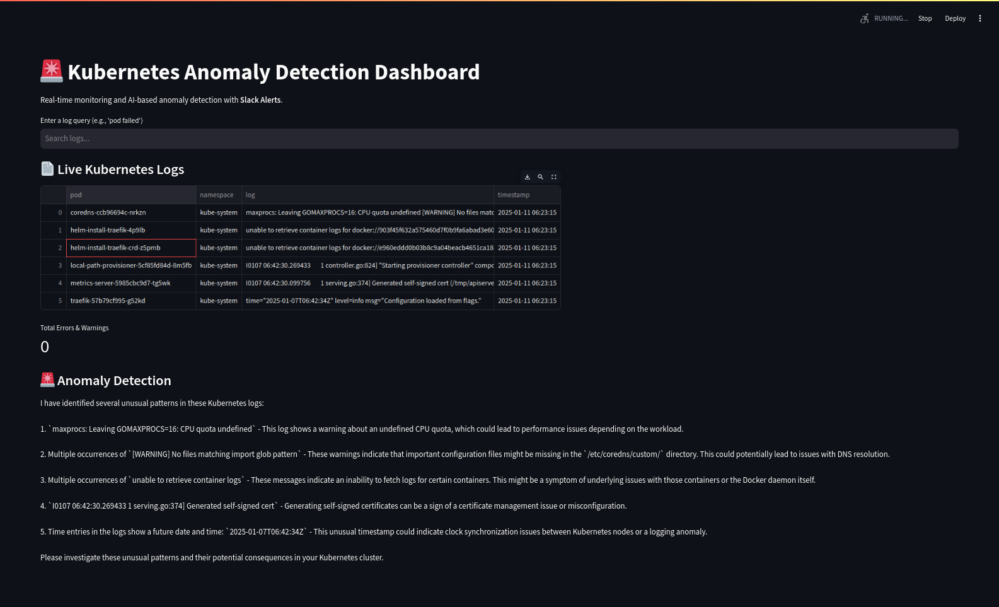

# 🚀 Kubernetes Anomaly Detection Dashboard  
**Real-time AI-powered log monitoring with FAISS and Groq AI**



## **📖 Overview**
This project is a **real-time Kubernetes anomaly detection dashboard** that enables engineers to:
✅ **Fetch logs from all Kubernetes pods dynamically**  
✅ **Search logs instantly using FAISS**  
✅ **Detect anomalies in real-time with AI**  
✅ **Receive Slack alerts for critical issues**  
✅ **Analyze logs with Groq AI for root cause suggestions**  

> **Stop manually searching through thousands of log lines! Use AI to debug Kubernetes efficiently.**

---

## **🛠️ Features**
### **🔍 Log Monitoring & Instant Search**
- Fetches logs from **all namespaces and pods** dynamically.
- Stores logs as embeddings using **FAISS** for **fast retrieval**.
- Users can search logs instantly via a **Streamlit UI**.

### **🧠 AI-Powered Anomaly Detection**
- Uses **Groq AI** to detect anomalies and **flag unusual log patterns**.
- Provides **AI-generated root cause analysis** for Kubernetes errors.

### **📡 Real-Time Alerts**
- **Slack notifications** are sent for critical issues.
- **Email alerts** notify teams when anomalies are detected.

### **📊 Interactive Dashboard**
- **View logs in real-time** using **Streamlit**.
- Monitor **error trends & anomalies**.
- **Filter logs** by namespace, pod, or error type.

---

## **🚀 Getting Started**
### **🔹 1. Clone the Repository**
```bash
git clone https://github.com/stwins60/k8s-anomaly-detection.git
cd k8s-anomaly-detection
```
### **🔹 2. Install Dependencies**
```bash
pip install -r requirements.txt
```
### **🔹 3. Set Up Environment Variables**
Create a `.env` file in the root directory with the following variables:
```bash
GROQ_API_KEY=your_groq_api_key
GROQ_ENDPOINT=https://api.groq.com/v1/chat/completions
SLACK_WEBHOOK_URL=your_slack_webhook
EMAIL_ALERTS_ENABLED=True
SMTP_SERVER=smtp.example.com
SMTP_PORT=587
EMAIL_SENDER=alerts@example.com
EMAIL_PASSWORD=your_email_password
EMAIL_RECEIVER=admin@example.com
```
### **🔹 4. 🔧 Running the Application**
1. Start the Streamlit Dashboard
    ```bash
    streamlit run app.py
    ```
2. Open the Streamlit UI in your browser: `http://localhost:8501`

## **📌 How It Works**
1. Fetch Kubernetes Logs
    - The dashboard fetches logs from all pods and namespaces.
    - Logs are stored as embeddings using FAISS for fast retrieval.
2. Search Logs Instantly
    - Users can search logs instantly using the Streamlit UI.
    - FAISS retrieves logs with similar embeddings.
3. AI-Powered Analysis
    - AI detects unusual log patterns and provides root cause analysis.
    - AI insights help engineers troubleshoot faster.
4. Get Alerts for Critical Issues
    - If an anomaly is detected, Slack alerts notify the team.
    - Email alerts are sent for critical issues.
